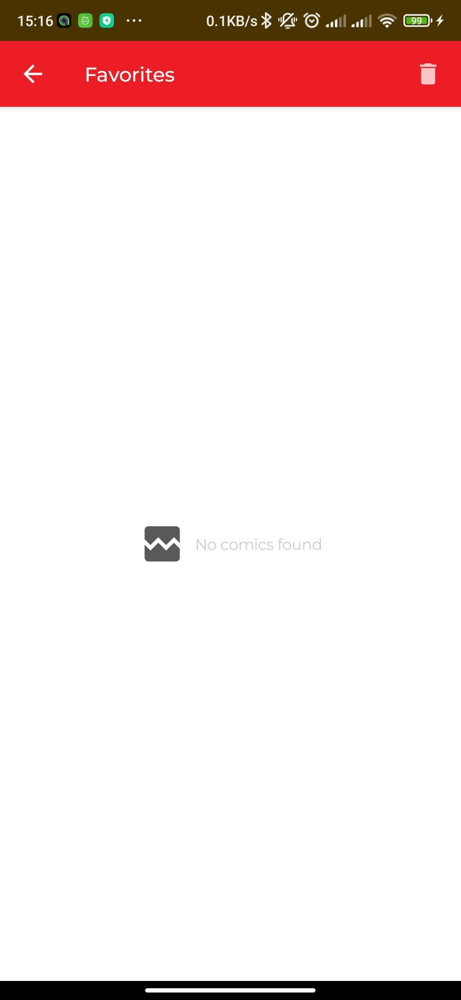

<h1 align="center">Marvel</h1>

A Marvel comics listing app using marvel api and Jetpack Compose. Based on MVVM architecture with kodein for DI.

## Screenshots

## Technologies
- [Kotlin](https://kotlinlang.org/) - %100 Kotlin
- [Jetpack Compose](https://developer.android.com/jetpack/compose) for Declarative UI
- [Landscapist Glide](https://github.com/skydoves/landscapist) for Network Image
- [Coroutines](https://github.com/Kotlin/kotlinx.coroutines) for asynchronous operations
- [ViewModel](https://developer.android.com/topic/libraries/architecture/viewmodel) and [LiveData](https://developer.android.com/topic/libraries/architecture/livedata)
- [Kodein-DI](https://docs.kodein.org/kodein-di/7.10/index.html) for dependency injection
- [OkHttp](https://github.com/square/okhttp) and [Retrofit](https://github.com/square/retrofit) for network operations
- [Hawk](https://github.com/orhanobut/hawk) Secure, simple key-value storage